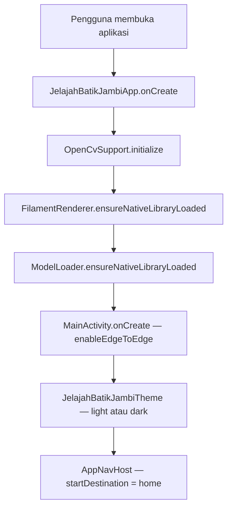
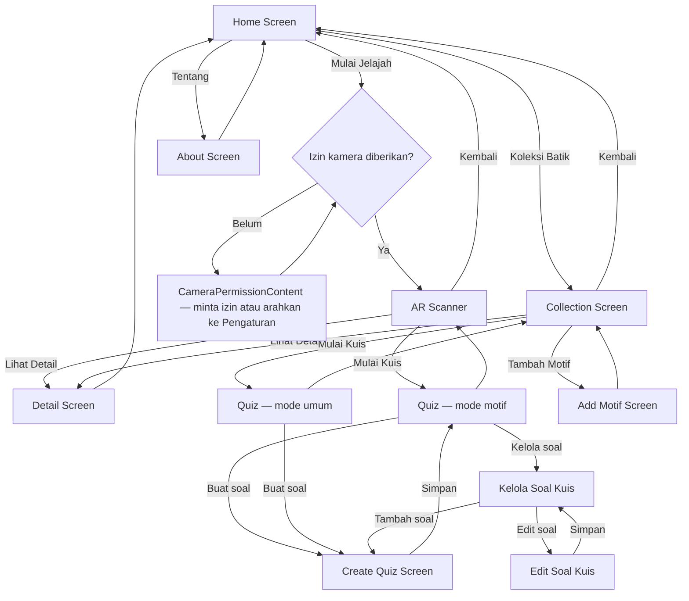
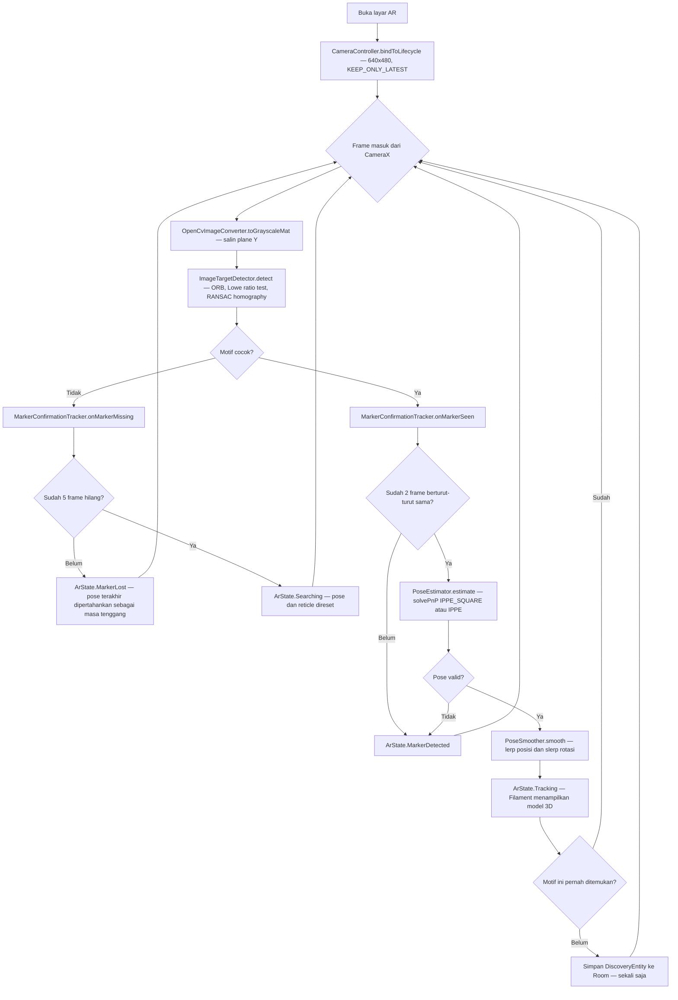
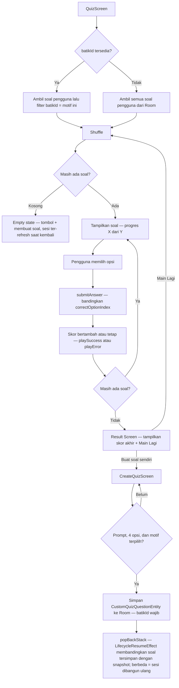
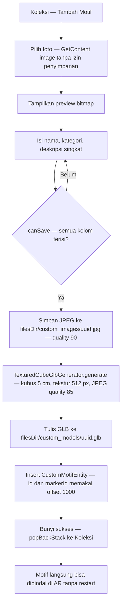
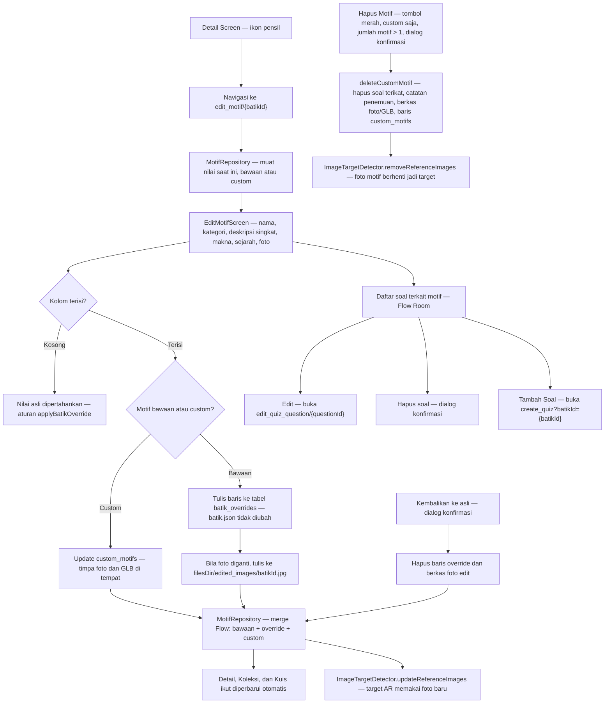
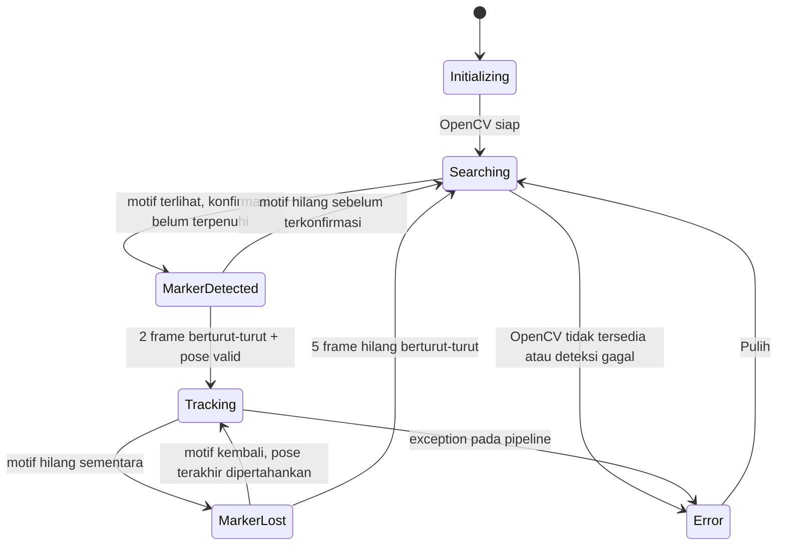
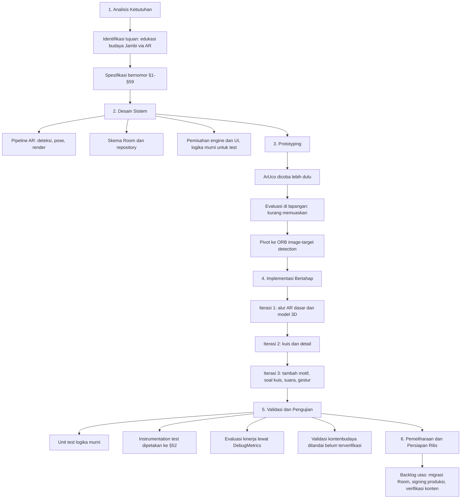

# Jelajah Batik Jambi

Aplikasi Android berbasis **Augmented Reality** untuk mengenal, menjelajah, dan belajar tentang budaya batik Jambi.

Pengguna mengarahkan kamera ke foto motif batik, lalu aplikasi **mendeteksi motif tersebut secara langsung**, menampilkan **model 3D** di atasnya, membuka **informasi motif**, dan menawarkan **kuis** singkat. Setiap motif yang berhasil dipindai otomatis tercatat sebagai **"ditemukan"** dan terbuka di menu Koleksi.

> **Status konten:** field `meaning` dan `history` pada data motif bawaan masih berupa *placeholder* yang menyatakan konten belum diverifikasi. Teks kultural ini sengaja tidak diisi dengan dugaan, dan kuis pun tidak mengujinya. Lengkapi hanya setelah diverifikasi dengan saksi atau referensi budaya Jambi yang sahih.

---

## Daftar Isi

- [Penjelasan Aplikasi untuk Sidang Skripsi](#penjelasan-aplikasi-untuk-sidang-skripsi)
- [Fitur Utama](#fitur-utama)
- [Diagram Alur Aplikasi](#diagram-alur-aplikasi)
- [Alur Penggunaan](#alur-penggunaan)
- [Tumpukan Teknologi](#tumpukan-teknologi)
- [Persyaratan Sistem](#persyaratan-sistem)
- [Cara Menjalankan](#cara-menjalankan)
- [Perintah Build Umum](#perintah-build-umum)
- [Struktur Proyek](#struktur-proyek)
- [Arsitektur](#arsitektur)
- [Pipeline AR](#pipeline-ar)
- [Konten dan Aset](#konten-dan-aset)
- [Menambah Motif](#menambah-motif)
- [Penyimpanan Data](#penyimpanan-data)
- [Navigasi](#navigasi)
- [Pengujian](#pengujian)
- [Metode Pengembangan](#metode-pengembangan)
- [Catatan dan Batasan](#catatan-dan-batasan)
- [Lisensi](#lisensi)

---

## Penjelasan Aplikasi untuk Sidang Skripsi

Bagian ini merangkum aplikasi secara padat sebagai bahan pemaparan di hadapan dosen penguji. Rincian teknis tersedia di [Arsitektur](#arsitektur), [Pipeline AR](#pipeline-ar), [Penyimpanan Data](#penyimpanan-data), dan [Metode Pengembangan](#metode-pengembangan).

### Ringkasan satu paragraf

**Jelajah Batik Jambi** adalah aplikasi Android berbasis *Augmented Reality* sebagai media edukasi budaya batik Jambi. Pengguna mengarahkan kamera ke foto motif batik — **tanpa marker cetak terpisah** — lalu aplikasi mengenali motif tersebut secara langsung, menampilkan **model 3D** di atasnya, dan membuka **informasi motif** beserta **kuis singkat**. Setiap motif yang berhasil dipindai tercatat sebagai **ditemukan** dan terbuka di menu Koleksi, sehingga terbentuk alur **pindai → temukan → pelajari → uji**. Aplikasi berjalan **sepenuhnya offline** tanpa backend, dan pengguna dapat **menambah serta mengedit motif sendiri**, sehingga konten dapat tumbuh tanpa memperbarui aplikasi.

### Posisi aplikasi terhadap masalah

| Elemen | Uraian |
|---|---|
| **Masalah** | Media edukasi batik yang umum berupa foto dan teks statis kurang mendorong pengguna mengenal motif satu per satu dan mengingatnya kembali. |
| **Solusi** | Mengubah motif menjadi titik pindai AR: motif asli dikenali kamera, ditampilkan dalam 3D, lalu pengguna diajak mengumpulkan motif dan menguji pemahamannya lewat kuis. |
| **Sasaran pengguna** | Siswa/pelajar, pengunjung museum atau pameran, dan umum yang ingin mengenal batik Jambi. |
| **Model konten** | Empat motif bawaan dari `batik.json` ditambah motif buatan pengguna; keduanya dapat diedit langsung dari aplikasi dan tersimpan permanen di perangkat. |

### Fitur dan kebutuhan yang dijawab

| # | Fitur | Kebutuhan yang dijawab | Bukti di kode |
|---|---|---|---|
| 1 | Pemindaian AR langsung ke foto motif (ORB + homography), tanpa marker cetak | §7, §16 — pengenalan motif lewat kamera | `ar/ImageTargetDetector.kt` |
| 2 | Model 3D mengikuti motif, dengan gestur putar, geser, cubit-zoom | §27 — interaksi objek 3D | `render/TransformController.kt`, `ui/ar/ArScreen.kt` |
| 3 | Panel informasi, halaman detail, dan kuis (mode motif, mode umum, buat soal sendiri) | §9–§14 — penyajian pengetahuan dan evaluasi | `ui/ar/ArInformationPanel.kt`, `ui/detail/`, `ui/quiz/` |
| 4 | Koleksi motif "ditemukan" vs terkunci | §15–§16 — motivasi mengumpulkan | `ui/collection/`, `database/DiscoveryEntity.kt` |
| 5 | Tambah dan **edit** motif oleh pengguna (teks + foto), tersimpan permanen | konten partisipatif tanpa update aplikasi | `ui/addmotif/`, `ui/editmotif/`, `data/repository/MotifRepository.kt` |
| 6 | Offline-first, tanpa backend dan biaya server | §45–§46 | `data/repository/BatikRepository.kt` |
| 7 | Konten budaya jujur: placeholder bila belum diverifikasi, tidak dikarang | §38 | `data/model/BatikData.kt` |
| 8 | 48 unit test terpetakan ke spesifikasi | §52 — validasi | `app/src/test`, `app/src/androidTest` |

### Alur demo di hadapan penguji (±5 menit)

1. **Instal APK** dari halaman [Rilis](https://github.com/JailaniGans/Jelajah-batik-jambi-AR/releases) (ikuti catatan Play Protect di catatan rilis).
2. Buka aplikasi → **Mulai Jelajah** → berikan izin kamera.
3. Arahkan ke salah satu foto motif di `batik_collections/` → pill berubah **Motif ditemukan**, model 3D muncul → demonstrasi gestur putar, geser, zoom.
4. Dari panel informasi, buka **Lihat Detail** → tunjukkan deskripsi dan informasi motif.
5. Tekan **ikon pensil** → edit deskripsi atau ganti foto → **Simpan** → kembali: detail, koleksi, dan deteksi AR langsung memakai data baru.
6. Kembali ke layar AR dan pindai motif yang sama dengan **foto yang baru diganti** → terdeteksi **tanpa restart aplikasi**.
7. Tekan **Kembalikan ke asli** + konfirmasi → motif kembali ke data bawaan.
8. Buka **Koleksi** → motif ditemukan terbuka, motif lain terkunci → **Mulai Kuis** → kerjakan, lalu tunjukkan pembuatan soal sendiri.

### Pertanyaan sidang yang lazim dan jawaban singkat

| Pertanyaan | Jawaban singkat |
|---|---|
| Memakai ARCore/ARKit? | Tidak. Deteksi dibangun sendiri dengan CameraX + OpenCV (ORB, Lowe ratio, RANSAC homography) dan pose dari solvePnP; render memakai Google Filament. Ringan, offline, dan tidak bergantung pada Play Services for AR. |
| Butuh marker cetak? | Tidak — foto motif asli langsung menjadi target. Jalur marker ArUco tetap tersedia sebagai alternatif (`ArucoDetector.kt`). |
| Butuh internet? | Tidak. Aset dibundel di APK, penyimpanan lewat Room, tanpa backend. |
| Bagaimana model 3D bisa muncul di atas motif? | Foto dikenali → homography → solvePnP → pose dihaluskan → Filament merender `.glb` di atas preview kamera, mengikuti gerakan perangkat. |
| Data disimpan di mana? | Room (`jelajah_batik_jambi.db`): penemuan, motif custom, soal kuis, dan override hasil edit. Berkas foto/model tersimpan di `filesDir` internal. |
| Kapan deteksi bisa gagal? | Pada cahaya rendah, blur, atau motif bertekstur sangat berulang. Tersedia kontrol senter, debounce konfirmasi 2 frame, masa tenggang 5 frame, dan pill status agar tampilan tidak berkedip. |
| Kenapa field makna dan sejarah masih placeholder? | Komitmen konten jujur (§38): teks kultural tidak diisi dengan dugaan sebelum diverifikasi dengan referensi sahih. |
| Seberapa akurat skala 3D-nya? | Sisi terpanjang motif diasumsikan 0,20 m; hasil akurat secara **relatif** terhadap motif, bukan ukuran dunia nyata, karena foto tidak membawa metadata skala. |
| Bagaimana performanya? | Deteksi dibatasi 10 FPS dengan metrik debug (`detectionMs`, `poseMs`, `processingFps`) yang dapat ditampilkan di layar AR. |
| Kenapa APK-nya besar? | Sekitar 200 MB karena 4 ABI OpenCV + Filament dalam satu APK. Rencana tindak lanjut: ABI split atau `.aab`. |

### Status dan batasan yang perlu disampaikan

- Build rilis masih memakai **debug keystore** — cukup untuk sidang dan uji coba, tetapi belum layak distribusi publik.
- Konten `meaning` dan `history` masih **placeholder** sampai diverifikasi dengan referensi budaya Jambi.
- Rincian batasan teknis lain tersedia di [Catatan dan Batasan](#catatan-dan-batasan).

---

## Fitur Utama

### 🔍 Jelajah AR (Pemindai Motif)

| Fitur | Keterangan |
|---|---|
| Deteksi motif langsung | Mendeteksi **foto motif batik asli** melalui kamera (ORB + homography), bukan harus mencetak marker terpisah |
| Model 3D | Menampilkan model `.glb` bertekstur di atas motif, mengikuti gerakan dan sudut pandang pengguna |
| Reticle pemindaian | Kotak siku yang "bernapas" saat mencari, lalu berubah menjadi kotak 4-sudut yang menempel pada motif terdeteksi |
| Panel informasi | Bottom sheet berisi nama, kategori, dan deskripsi motif, plus tombol **Mulai Kuis** dan **Lihat Detail** |
| Indikator status | Pill status: Mencari / Mengunci / **Motif ditemukan** / Hilang / Error. Setelah motif pertama ditemukan dalam sesi AR, pill tetap menampilkan **Motif ditemukan** walau kamera menjauh |
| Interaksi objek | 1 jari = putar, 2 jari = geser, cubit-zoom = ubah skala, ketuk dua kali = reset |
| Lampu senter | Kontrol torch untuk pencahayaan saat memindai motif gelap |
| Ketahanan | Debounce konfirmasi/hilang marker, smoothing pose, dan status "sticky" agar objek tidak berkedip hilang saat tracking sesaat terputus |

### 📚 Koleksi Batik

- Daftar motif bawaan dan motif buatan pengguna, dengan penanda **ditemukan** atau belum.
- Motif yang belum ditemukan masih terlihat sebagai kunci, memberi tujuan untuk terus memindai.
- Navigasi ke halaman detail, dan akses kuis umum — tombol **Mulai Kuis** selalu tersedia, tidak menunggu motif ditemukan.

### 🎓 Kuis

- Seluruh soal **ditulis pengguna sendiri** — aplikasi tidak lagi membuat soal otomatis. Mulai dari halaman Kuis (ikon **+**) atau dari layar Edit Motif.
- **Mode motif** (dari AR): hanya soal yang terikat ke motif yang sedang dipindai.
- **Mode umum** (dari Koleksi): semua soal buatan pengguna, di-*shuffle*. Tombol **Mulai Kuis** selalu tersedia, tidak menunggu motif ditemukan.
- **Setiap soal wajib menentukan motif** lewat dropdown pilihan (bawaan + custom) saat dibuat maupun diedit; soal lama tanpa motif wajib memilih motif saat diedit berikutnya.
- **Kelola soal**: daftar soal tampil di layar **Kelola Soal Kuis** (dari ikon kelola di bilah atas Kuis) dan di **Edit Motif** — lengkap dengan Edit, Hapus (dialog konfirmasi), dan Tambah Soal untuk motif tersebut.
- Umpan balik benar/salah lewat **ikon + warna** (bukan warna saja), dilengkapi efek suara; layar hasil punya tombol **Main Lagi**.

### 🖼️ Tambah Motif

- Pilih foto dari galeri (tanpa izin penyimpanan, memakai `ActivityResultContracts.GetContent`).
- Isi nama, kategori, dan deskripsi singkat.
- Aplikasi **membuat model 3D kubus bertekstur secara on-device** dari foto tersebut.
- Motif baru langsung menjadi target yang dapat dipindai di AR **tanpa perlu restart**.

### ✏️ Edit Motif

- Ikon **pensil** di layar Detail membuka form edit untuk **motif bawaan maupun motif buatan pengguna**.
- Field yang bisa diedit: nama, kategori, deskripsi singkat, makna, sejarah, dan **foto motif**. Kolom yang dikosongkan dianggap "tidak diedit", sehingga nilai asli dipertahankan.
- **Kelola soal motif ini**: layar edit menampilkan daftar soal kuis yang terikat ke motif tersebut (live dari Room) — tiap baris bisa **Edit** (membuka layar Edit Soal), **Hapus** (dialog konfirmasi), dan ada tombol **Tambah Soal** yang membuka Buat Soal dengan motif sudah terpilih.
- **Hapus motif custom**: tombol merah **Hapus Motif** khusus motif buatan pengguna, hanya muncul bila jumlah motif lebih dari 1, dan berdialog konfirmasi. Penghapusan berantai: soal terikat, catatan penemuan, berkas foto/GLB, baris `custom_motifs`, sampai target deteksi AR ikut hilang.
- Motif bawaan diedit lewat tabel overlay `batik_overrides` — `batik.json` tetap utuh sebagai cadangan, dan ada tombol **Kembalikan ke asli** dengan dialog konfirmasi.
- Foto edit disimpan di penyimpanan internal (`edited_images/`), foto motif custom ditimpa di tempat (tanpa berkas yatim), dan model GLB custom digenerate ulang.
- Perubahan langsung terlihat di Detail, Koleksi, Kuis, dan **target deteksi AR** diperbarui tanpa restart aplikasi.
- Semua hasil edit dan tambahan motif **tersimpan permanen** di perangkat (Room + berkas internal) dan bertahan setelah aplikasi ditutup.

### 🎨 Antarmuka

- Jetpack Compose + Material 3 dengan palet bernuansa Jambi (marun, emas, cokelat tua, krem, hijau).
- Mode terang dan gelap mengikuti pengaturan sistem.
- Transisi layar halus (fade + slide 200 ms).
- Efek suara sintetis lewat `ToneGenerator`, tanpa berkas audio yang perlu disertakan.

---

## Diagram Alur Aplikasi

Diagram berikut memakai **Mermaid** dan otomatis dirender oleh GitHub maupun editor yang mendukung Mermaid.

### 1. Alur Startup Aplikasi



### 2. Alur Navigasi Utama



### 3. Alur Pemindaian AR (satu siklus deteksi)



### 4. Alur Kuis



### 5. Alur Tambah Motif (Milik Pengguna)



### 6. Alur Edit Motif (Bawaan dan Custom)



### 7. State Machine Pipeline AR



---

## Alur Penggunaan

### Skenario 1 — Menjelajah dan Memindai Motif

1. Buka aplikasi, Anda akan langsung sampai di **Home**.
2. Tekan **Mulai Jelajah**.
3. Berikan izin kamera saat diminta.
4. Arahkan kamera ke foto motif batik, atau cetak dari folder `batik_collections/`.
5. Tunggu reticle berubah menjadi kotak 4-sudut yang menempel pada motif, lalu indikator berubah menjadi **Mengikuti**.
6. Model 3D muncul di atas motif.
7. Interaksi model sesuai kebutuhan:
   - geser satu jari untuk memutar,
   - geser dua jari untuk menggeser,
   - cubit untuk memperbesar atau memperkecil,
   - ketuk dua kali untuk mengembalikan ke posisi awal.
8. Gunakan tombol senter jika pencahayaan kurang.
9. Panel informasi di bawah menampilkan nama, kategori, dan deskripsi motif.

### Skenario 2 — Menuju Detail atau Kuis dari AR

1. Dari panel informasi, tekan **Lihat Detail** untuk membuka halaman detail motif lengkap.
2. Atau tekan **Mulai Kuis** untuk langsung mengerjakan kuis khusus motif tersebut.
3. Setelah selesai, tekan **Kembali** untuk kembali ke layar AR; status tracking dan model 3D tetap tampil.

### Skenario 3 — Melihat Koleksi

1. Dari Home, tekan **Koleksi Batik**.
2. Motif yang sudah pernah dipindai tampil penuh; motif yang belum ditemukan tampil terkunci.
3. Tekan salah satu motif untuk membuka detailnya.
4. Tekan **Mulai Kuis** untuk mengerjakan kuis umum berisi semua soal buatan pengguna — tombol selalu tersedia walau belum ada motif ditemukan.
5. Tekan ikon **+** untuk menambah motif sendiri.

### Skenario 4 — Menambah Motif Sendiri

1. Dari **Koleksi**, tekan **Tambah Motif**.
2. Pilih foto motif dari galeri.
3. Isi nama, kategori, dan deskripsi singkat.
4. Tekan **Simpan**; aplikasi membuat model 3D secara otomatis.
5. Motif baru langsung muncul di Koleksi dan dapat langsung dipindai di AR.

### Skenario 5 — Mengedit Motif

1. Buka **Detail** motif mana pun (bawaan atau buatan pengguna), lalu tekan ikon **pensil** di bilah atas.
2. Ubah nama, kategori, deskripsi singkat, makna, sejarah, dan/atau ganti foto. Kolom yang dibiarkan kosong tetap memakai nilai asli.
3. Gulir ke bagian **Soal Kuis untuk Motif Ini**: tekan **Edit** pada salah satu baris untuk membuka layar Edit Soal, **Hapus** untuk menghapusnya (dialog konfirmasi), atau **Tambah Soal** untuk membuat soal baru dengan motif sudah terpilih otomatis.
4. Tekan **Simpan**. Perubahan langsung terlihat di Detail, Koleksi, dan target deteksi AR, tanpa restart.
5. Untuk motif bawaan, tersedia tombol **Kembalikan ke asli** dengan dialog konfirmasi untuk menghapus hasil edit.
6. Untuk motif custom, tersedia tombol merah **Hapus Motif** — hanya bila jumlah motif lebih dari 1 — dengan dialog konfirmasi; soal terikat, catatan penemuan, berkas foto/model, dan target AR ikut terhapus.

### Skenario 6 — Membuat Soal Kuis Sendiri

1. Dari halaman Kuis, tekan ikon **+** pada bilah atas (dari kuis motif, motif sudah terpilih otomatis) — atau lewat **Tambah Soal** di layar Edit Motif.
2. Pilih motif tujuan soal pada dropdown **Motif terkait** (wajib; berisi motif bawaan dan custom).
3. Tulis pertanyaan.
4. Isi tepat empat pilihan jawaban.
5. Pilih jawaban yang benar memakai `RadioButton`.
6. Tekan **Simpan**; soal langsung masuk ke pool kuis berikutnya.

### Skenario 7 — Menghemat Baterai

1. AR adalah fitur yang paling boros daya. Gunakan kontrol senter seperlunya.
2. Jangan biarkan aplikasi terbuka di layar AR saat tidak dipakai.
3. Kuis dan Koleksi tidak memakai kamera sama sekali.

---

## Tumpukan Teknologi

| Kategori | Teknologi | Versi |
|---|---|---|
| Bahasa | Kotlin | 2.4.20 |
| Build | Android Gradle Plugin | 9.4.1 |
| Build | Gradle Wrapper | 9.6.0 |
| UI | Jetpack Compose (BOM) | 2026.02.01 |
| UI | Material 3, Animation, Icons Extended | - |
| Navigasi | Navigation Compose | 2.9.7 |
| Lifecycle | Lifecycle runtime, viewmodel, compose | 2.11.0 |
| Kamera | CameraX core, camera2, lifecycle, view | 1.5.1 |
| Computer Vision | OpenCV Android AAR | 5.0.0.1 |
| Render 3D | Google Filament + glTFIO | 1.77.1 |
| Persistensi | Room runtime + KSP compiler | 2.8.5 |
| Async | Kotlin Coroutines | 1.11.0 |
| Testing | JUnit 4, Espresso, Compose UI Test | 4.13.2 / 3.5.1 / - |

Versi dependency dikelola terpusat melalui **version catalog** di `gradle/libs.versions.toml`.

### Konfigurasi modul `app`

| Properti | Nilai |
|---|---|
| `namespace` dan `applicationId` | `com.jelajahbatikjambi` |
| `minSdk` | 26 (Android 8.0 Oreo) |
| `compileSdk` dan `targetSdk` | 37 |
| `versionCode` dan `versionName` | 6 / 1.4.0 |
| Target bytecode Java | 11 |
| Build features | `compose = true`, `buildConfig = true` |

### Izin Android

```
android.permission.CAMERA
android.hardware.camera           (required)
android.hardware.camera.autofocus (optional)
```

Kamera ditandai **required**, sehingga aplikasi tidak dapat diinstal pada perangkat tanpa kamera.

---

## Persyaratan Sistem

- **JDK 17 atau lebih baru** untuk menjalankan Gradle 9.x. Android Studio dengan JBR bawaan sudah memenuhi.
- **Android SDK Platform 37** terpasang, beserta Build Tools yang sesuai.
- Perangkat atau emulator berkamera untuk menguji modul AR. Emulator sebaiknya memakai skin dengan kamera virtual.

---

## Cara Menjalankan

1. **Buka proyek**

   ```bash
   git clone <url-repo>
   ```

   atau buka folder ini langsung di Android Studio.

2. **Pastikan `local.properties` menunjuk ke SDK Android Anda**

   ```properties
   sdk.dir=C\:\\Users\\<nama-user>\\AppData\\Local\\Android\\Sdk
   ```

   File ini **tidak** di-*commit* karena sudah ada di `.gitignore`.

3. **Jalankan di perangkat**

   ```bash
   ./gradlew installDebug
   ```

   atau gunakan `./gradlew app:run` dari Android Studio pada perangkat atau emulator yang aktif.

4. **Saat aplikasi dibuka**
   - Tekan **Mulai Jelajah**, berikan izin kamera, lalu arahkan ke foto motif batik.
   - Tekan **Koleksi Batik** untuk melihat motif yang sudah ditemukan.
   - Tekan **+** pada halaman Kuis untuk membuat soal sendiri.

### Instalasi build `release` via adb (opsional)

Versi rilis yang sudah ditandatangani tersedia di halaman
[**Releases**](https://github.com/JailaniGans/Jelajah-batik-jambi-AR/releases)
beserta catatan pemasangannya. Untuk membangun sendiri:

Build `release` sengaja memakai **keystore debug** dan **optimasi dimatikan** agar bisa langsung di-*install* untuk pengujian lokal:

```bash
./gradlew assembleRelease
adb install -r app/build/outputs/apk/release/app-release.apk
```

> Ganti dengan konfigurasi signing asli sebelum distribusi apa pun.

---

## Perintah Build Umum

```bash
./gradlew build                 # build dan jalankan semua test
./gradlew assembleDebug         # APK debug
./gradlew test                  # unit test di JVM
./gradlew connectedAndroidTest  # instrumentation test, butuh perangkat
./gradlew lint                  # Android Lint
./gradlew clean
```

Di Windows gunakan `gradlew.bat`, atau `./gradlew` bila Git Bash atau WSL aktif.

---

## Struktur Proyek

```
JelajahBatikJambi/
├── app/
│   ├── build.gradle.kts            # konfigurasi modul app
│   └── src/
│       ├── main/
│       │   ├── AndroidManifest.xml
│       │   ├── assets/
│       │   │   ├── data/batik.json         # metadata motif bawaan
│       │   │   ├── images/                 # foto motif, sekaligus target deteksi
│       │   │   └── models/                 # model 3D .glb per motif
│       │   ├── java/com/jelajahbatikjambi/
│       │   │   ├── JelajahBatikJambiApp.kt  # Application, init OpenCV dan Filament
│       │   │   ├── MainActivity.kt         # activity tunggal
│       │   │   ├── ar/                     # engine deteksi dan pose, bebas Compose
│       │   │   │   ├── ArController.kt     # orkestrator pipeline per frame
│       │   │   │   ├── ArState.kt          # status Searching, Tracking, dan lainnya
│       │   │   │   ├── ImageTargetDetector.kt  # detektor ORB, jalur aktif
│       │   │   │   ├── ArucoDetector.kt        # detektor ArUco, jalur alternatif
│       │   │   │   ├── MarkerConfirmationTracker.kt # debounce konfirmasi dan hilang
│       │   │   │   ├── PoseEstimator.kt     # solvePnP menjadi RawPose
│       │   │   │   ├── PoseSmoother.kt      # lerp posisi dan slerp rotasi
│       │   │   │   ├── CameraIntrinsics.kt  # fx, fy, cx, cy
│       │   │   │   ├── CoordinateConverter.kt
│       │   │   │   ├── MarkerResult.kt, MotifDetector.kt, Pose.kt
│       │   │   │   └── DetectedRegion.kt, DebugMetrics.kt, OpenCvSupport.kt
│       │   │   ├── camera/                # binding CameraX dan konversi YUV ke Mat
│       │   │   ├── render/                # Filament: renderer, model, transform
│       │   │   │   ├── FilamentRenderer.kt
│       │   │   │   ├── ModelLoader.kt
│       │   │   │   ├── RenderLifecycle.kt
│       │   │   │   ├── SceneController.kt
│       │   │   │   ├── TexturedCubeGlbGenerator.kt
│       │   │   │   └── TransformController.kt
│       │   │   ├── data/
│       │   │   │   ├── model/              # BatikData, QuizQuestion
│       │   │   │   └── repository/         # MotifRepository (gabungan), BatikRepository, Custom*, Discovery
│       │   │   ├── database/               # Room: AppDatabase, Entity (termasuk BatikOverride), Dao
│       │   │   └── ui/
│       │   │       ├── navigation/         # AppRoutes, AppNavHost
│       │   │       ├── theme/              # Color, Theme, Type, Shapes, Dimensions
│       │   │       ├── common/             # AssetImage, SoundEffects
│       │   │       └── home, ar, collection, detail, quiz, addmotif, editmotif, about
│       │   └── res/
│       ├── test/                            # unit test di JVM
│       └── androidTest/                     # instrumentation dan Compose UI test
├── gradle/libs.versions.toml                 # version catalog
├── batik_collections/                        # foto motif sumber
├── markers_for_printing/                     # marker ArUco siap cetak, alternatif
├── build.gradle.kts, settings.gradle.kts, gradle.properties
└── gradlew, gradlew.bat
```

---

## Arsitektur

Arsitektur **single-activity + Compose Navigation**, dengan pemisahan tegas antara *engine* dan *UI*:

```
┌────────────────────────────────────────────────┐
│  UI  (Jetpack Compose, ui/*)                   │
│  Screen · ViewModel (StateFlow) · Overlay AR   │
└────────────────┬───────────────────────────────┘
                 │ StateFlow: state, pose, debugMetrics
                 │ ImageProxy: frame kamera
┌────────────────▼───────────────────────────────┐
│  ENGINE  (ar/*, camera/*, render/*)             │
│  Tanpa referensi ke Compose, Activity, Context │
└────────────────┬───────────────────────────────┘
                 │
┌────────────────▼───────────────────────────────┐
│  DATA  (data/*, database/*, assets/*)          │
│  Repository sebagai sumber kebenaran, lalu Room│
└────────────────────────────────────────────────┘
```

Prinsip yang dipegang:

- **`ar/`, `camera/`, dan `render/` tidak mengimpor Compose.** Semua keluar-masuk melalui `StateFlow` dan fungsi biasa, sehingga logika inti dapat diuji tanpa Android.
- **Konten punya satu sumber kebenaran.** `MotifRepository` menggabungkan motif bawaan (`assets/data/batik.json`), hasil edit pengguna (tabel `batik_overrides`), dan motif custom (tabel `custom_motifs`) menjadi satu `Flow<List<BatikData>>`. Semua konsumen — AR, Koleksi, Detail, dan Kuis — mengamati aliran yang sama, sehingga edit dan motif baru langsung terlihat di seluruh aplikasi. Target deteksi AR dibangun dari `imagePath` serta `markerId` pada daftar tersebut, bukan dari daftar gambar hardcoded kedua.
- **UI hanya mengamati, bukan memutuskan.** ViewModel mengekspos `StateFlow`, dan keputusan bisnis seperti kapan menyimpan penemuan terjadi di ViewModel.
- **State komposit tetap di screen.** Rotasi, offset, dan skala yang dapat diubah pengguna di AR sengaja disimpan di `ArScreen` agar bertahan saat tracking sesaat terputus. Sementara itu `pose` dan `detectedBatik` di ViewModel bersifat *sticky* agar objek dan panel tidak berkedip hilang.

---

## Pipeline AR

Alur satu frame kamera:

```
CameraX ImageAnalysis (640x480, KEEP_ONLY_LATEST)
   │
   ▼
OpenCvImageConverter.toGrayscaleMat()      hanya menyalin plane Y atau luminansi,
   │                                       dengan menghormati rowStride
   ▼
ArController.onFrame()                      gate FPS, default 10 FPS untuk
   │                                       deteksi berbasis gambar
   ▼
ImageTargetDetector.detect(gray)            ORB 500 fitur, lalu BFMatcher Hamming
   │                                       kNN k=2
   │                                       Lowe ratio test 0.75
   │                                       findHomography RANSAC, 5 px, 2000 iterasi,
   │                                       confidence 0.995
   │                                       perlu minimal 15 inlier dan rasio 0.4
   ▼
MarkerConfirmationTracker                   2 frame berturut-turut berarti konfirmasi,
   │                                       5 frame berarti masa tenggang hilang
   ▼
PoseEstimator.estimate()                    solvePnP dengan IPPE_SQUARE atau IPPE,
   │                                       tanpa koreksi distorsi
   ▼
CoordinateConverter.toPose()                ruang kamera OpenCV ke ruang render
   ▼
PoseSmoother.smooth()                       lerp posisi dan slerp rotasi, faktor 0.35
   ▼
StateFlow<Pose>  ---------------------------->  FilamentView, overlay 3D
StateFlow<ArState> ------------------------->  Reticle, StatusPill, InfoPanel
```

Detail penting:

- **Deteksi langsung ke foto motif, bukan marker cetak.** Gambar referensi di-precompute ORB 1000 fitur sekali, dan setiap frame hanya mengekstrak 500 fitur lalu mencocokkannya. Motif milik pengguna yang baru ditambahkan dan hasil edit foto langsung masuk lewat `updateReferenceImages()` (referensi diganti berdasarkan id, tanpa membangun ulang detektor dan tanpa restart).
- **Ukuran dunia diasumsikan** panjang sisi terpanjang 0,20 meter, sebagai perkiraan kain atau print terlipat, karena foto tidak membawa metadata skala.
- **Intrinsics kamera** diambil dari karakteristik Camera2 berupa focal length dan ukuran sensor bila tersedia. Bila tidak, sistem memakai fallback estimasi HFOV sekitar 53 derajat, dan hasilnya selalu di-*cache* per resolusi analisis.
- **Debounce dan smoothing** mencegah objek berkedip saat pencahayaan berubah atau marker terputus sesaat.
- **Model di-cache berdasarkan path**, sehingga berpindah motif tidak memuat ulang `.glb` yang sama. Model baru masuk dengan animasi skala 0,8 ke 1,0 memakai ease-out cubic selama 250 ms.
- **Render dikomposisikan di atas kamera** dengan `BlendMode.TRANSLUCENT` dan clear color transparan, memakai dua lampu directional, yaitu key hangat 110k lux dan fill dingin 30k lux, sebagai pengganti IBL.
- **ArucoDetector** dengan `DICT_4X4_50` dan `useAruco3Detection` tersedia sebagai alternatif untuk alur cetak marker, namun jalur default adalah foto motif langsung.
- **Metrik debug** berupa `detectionMs`, `poseMs`, dan `processingFps` tersedia via `StateFlow` untuk keperluan aided.

### Interaksi objek di AR

| Gestur | Efek |
|---|---|
| 1 jari atau drag | Rotasi lewat quaternion axis-angle pada yaw dan pitch, sekitar 0,01 rad per piksel |
| 2 jari atau lebih | Translasi sekitar 0,0008 meter per piksel |
| Cubit | Skala, dibatasi 0,3 kali sampai 3,0 kali |
| Ketuk dua kali | Reset rotasi, offset, dan skala |

Transformasi pengguna dikomposisikan **di atas** pose hasil tracking dengan rumus `userRotation * pose.rotation`, sehingga objek tetap menempel pada marker sambil tetap bisa dilihat dari sisi lain.

---

## Konten dan Aset

### Struktur `assets/data/batik.json`

Array berisi empat motif bawaan:

```json
[
  {
    "id": 1,
    "markerId": 0,
    "name": "Angso Duo",
    "category": "Motif Batik Jambi",
    "shortDescription": "...",
    "meaning": "...",
    "history": "...",
    "imagePath": "images/angso_duo.jpeg",
    "modelPath": "models/motif_angso_duo.glb"
  }
]
```

| Field | Tipe | Keterangan |
|---|---|---|
| `id` | int | Identitas motif untuk navigasi, detail, dan kuis |
| `markerId` | int | Kunci yang memetakan motif ke hasil deteksi AR |
| `name`, `category`, `shortDescription` | string | Konten yang ditampilkan di UI |
| `meaning`, `history` | string | Konten budaya, saat ini placeholder belum diverifikasi |
| `imagePath` | string nullable | Relatif terhadap `assets/`, dipakai sebagai gambar 2D sekaligus target deteksi |
| `modelPath` | string nullable | Relatif terhadap `assets/`, dimuat oleh Filament |

Motif bawaan saat ini adalah **Angso Duo**, **Tampuk Manggis**, **Durian Pecah**, dan **Kapal Sanggat**.

### Folder di luar modul `app`

| Folder | Isi | Peran |
|---|---|---|
| `batik_collections/` | 6 foto motif sumber | Referensi dan dokumentasi materi visual |
| `markers_for_printing/` | 4 marker ArUco, satu per motif bawaan | Alternatif cetak untuk alur `ArucoDetector` |

---

## Menambah Motif

### Menambah motif bawaan sebagai developer

1. Taruh foto motif ke `app/src/main/assets/images/` dan model 3D `.glb` ke `app/src/main/assets/models/`.
2. Tambahkan entri baru di `app/src/main/assets/data/batik.json` dengan `id` dan `markerId` unik.
3. Build ulang. Tidak ada kode yang perlu diubah, karena deteksi AR, Koleksi, Detail, dan Kuis membaca daftar yang sama.

> **Tips:** foto target sebaiknya beresolusi wajar, pencahayaan merata, dan tidak terlalu ramai agar ORB dan RANSAC menghasilkan cukup inlier. Motif dengan tekstur sangat berulang, misalnya garis tipis rapat, lebih sulit terdeteksi.

### Menambah motif dari aplikasi sebagai pengguna

Pengguna memilih foto melalui **Koleksi lalu Tambah Motif**. Alurnya:

1. Foto disalin ke `filesDir/custom_images/<uuid>.jpg` dengan JPEG quality 90.
2. `TexturedCubeGlbGenerator` membuat model kubus 5 cm bertekstur secara on-device, berupa glTF 2.0 atau GLB valid dengan 6 sisi, tekstur 512 px yang di-center-crop, JPEG quality 85, material `metallic 0.0` dan `roughness 0.8`, serta sampler repeat dengan linear-mipmapped.
3. Keluarannya ditulis ke `filesDir/custom_models/<uuid>.glb`.
4. Baris `CustomMotifEntity` ditambahkan ke Room.

Motif bawaan dan motif custom tidak akan pernah bentrok. Repository custom memakai offset ID `CUSTOM_ID_OFFSET = 1000` untuk kedua field, yaitu `id` maupun `markerId`.

### Mengedit motif dari aplikasi

Detail punya ikon **pensil** yang membuka `edit_motif/{batikId}` untuk motif bawaan maupun custom. Cara kerjanya:

1. Nilai saat ini dimuat dari `MotifRepository` dan mengisi form. Kolom yang dibiarkan kosong dianggap tidak diedit, sehingga nilai asli dipertahankan (`applyBatikOverride`).
2. **Motif bawaan** ditulis sebagai baris di tabel overlay `batik_overrides` dengan `batikId` sebagai primary key — `assets/data/batik.json` tidak pernah diubah. `id` dan `markerId` tidak dapat diedit agar deteksi AR, `DiscoveryEntity`, dan kuis tetap konsisten.
3. **Motif custom** di-update langsung di `custom_motifs`; bila foto diganti, berkas `custom_images/<uuid>.jpg` ditimpa dan GLB digenerate ulang, sehingga tidak ada berkas yatim.
4. Foto hasil edit motif bawaan ditulis ke `filesDir/edited_images/{batikId}.jpg` dan ditimpa pada setiap edit.
5. `ImageTargetDetector.updateReferenceImages()` mengganti referensi berdasarkan id, sehingga foto baru langsung menjadi target deteksi **tanpa restart**.
6. Tombol **Kembalikan ke asli** (motif bawaan saja) menghapus baris override beserta berkas foto edit, lalu nilai bawaan kembali dipakai.
7. Bagian **Soal Kuis untuk Motif Ini** memuat daftar soal lewat `CustomQuizQuestionDao.observeByBatikId()` (Flow, jadi perubahan dari layar lain langsung terlihat): **Edit** membuka `edit_quiz_question/{questionId}`, **Hapus** menghapus baris soal lewat dialog konfirmasi, dan **Tambah Soal** membuka `create_quiz?batikId={batikId}` dengan motif sudah terpilih.

### Menghapus motif custom

Tombol merah **Hapus Motif** hanya muncul untuk motif buatan pengguna **dan** hanya bila jumlah motif (bawaan + custom) lebih dari 1 — `EditMotifUiState.canDelete` menjaga aplikasi tidak pernah kehabisan motif. Setelah dialog konfirmasi, `MotifRepository.deleteCustomMotif()` meniadakan semuanya dalam satu berkas masuk:

1. Baris `custom_motifs` (dan otomatis seluruh override/identitas custom).
2. Seluruh soal kuis terikat (`deleteByBatikId` pada `custom_quiz_questions`) — tidak ada soal yatim.
3. Catatan penemuan (`deleteByBatikId` pada `discoveries`) — motif langsung hilang dari Koleksi.
4. Berkas foto dan GLB — hanya dihapus bila berada di direktori upload milik aplikasi (`custom_images/`, `custom_models/`), aturan yang sama dengan reset foto edit.
5. `ImageTargetDetector.removeReferenceImages()` di AR — foto motif berhenti menjadi target deteksi, dan `ArViewModel` membuang entri referensi usangnya.

---

## Penyimpanan Data

Database bernama **`jelajah_batik_jambi.db`**, versi **5**, dengan `exportSchema = false`.

| Entity | DAO | Fungsi |
|---|---|---|
| `DiscoveryEntity` | `DiscoveryDao` | Motif yang sudah pernah dipindai, dengan `batikId` sebagai primary key dan `discoveredAt`. Memakai `OnConflictStrategy.IGNORE`, sehingga pemindaian ulang tidak menimpa waktu penemuan asli. |
| `CustomMotifEntity` | `CustomMotifDao` | Motif buatan pengguna, berupa path gambar dan model GLB di storage internal, plus kolom `meaning` dan `history` untuk hasil edit. |
| `CustomQuizQuestionEntity` | `CustomQuizQuestionDao` | Soal kuis buatan pengguna, dengan `optionA` sampai `optionD` plus indeks jawaban benar dan `batikId` yang menautkan soal ke motif (`DEFAULT -1` untuk soal lama sebelum keterikatan motif jadi wajib). |
| `BatikOverrideEntity` | `BatikOverrideDao` | Overlay hasil edit motif bawaan, dengan `batikId` sebagai primary key. Kolom `null` berarti "tidak diedit", sehingga nilai dari `batik.json` tetap dipakai. |

Migrasi eksplisit disediakan lewat **`MIGRATION_3_4`** (membuat tabel `batik_overrides` dan menambah kolom `meaning`/`history` pada `custom_motifs`) dan **`MIGRATION_4_5`** (menambah kolom `batikId` pada `custom_quiz_questions`, dengan `DEFAULT -1` agar soal lama tetap dianggap tidak terikat motif), sehingga data penemuan, motif custom, dan soal kuis pengguna **tetap bertahan** saat naik dari versi 3 ke 5. `fallbackToDestructiveMigration(true)` masih dipertahankan sebagai jaring pengaman untuk versi berikutnya, tetapi **setiap kenaikan versi wajib menyertai migrasi eksplisit**, lihat [Catatan dan Batasan](#catatan-dan-batasan).

Hasil edit motif bawaan disimpan sebagai berkas terpisah di `filesDir/edited_images/{batikId}.jpg`, sehingga reset "Kembalikan ke asli" cukup menghapus baris override dan berkas tersebut.

---

## Navigasi

**Sebelas rute**, ditransisikan dengan fade dan slide horizontal selama 200 ms.

| Rute | Layar | Tujuan |
|---|---|---|
| `home` | Home | Titik masuk: Mulai Jelajah, Koleksi Batik, Tentang |
| `ar` | AR Scanner | Kamera dengan overlay 3D, mendasarui navigasi ke detail dan kuis |
| `collection` | Koleksi | Daftar motif, mendasarui navigasi ke detail, kuis, dan tambah motif |
| `detail/{batikId}` | Detail | Informasi lengkap satu motif, dengan ikon pensil ke `edit_motif` |
| `edit_motif/{batikId}` | Edit Motif | Form edit teks dan foto, kelola soal terkait, dan hapus motif custom |
| `quiz?batikId={id}` | Kuis | `batikId` ada berarti kuis terfokus motif, tidak ada berarti kuis umum |
| `create_quiz?batikId={id}` | Buat Soal | Menambah soal milik pengguna; `batikId` opsional untuk pre-select motif |
| `manage_custom_quiz` | Kelola Soal Kuis | Daftar semua soal milik pengguna: edit, hapus, tambah |
| `edit_quiz_question/{questionId}` | Edit Soal Kuis | Mengubah satu soal, termasuk motif terkaitnya |
| `add_motif` | Tambah Motif | Menambah motif milik pengguna |
| `about` | Tentang | Informasi aplikasi |

Parameter opsional pada rute kuis dan buat soal memakai `defaultValue = -1` dan bukan `null`, karena `NavType.IntType` tidak dapat dideklarasikan nullable.

---

## Pengujian

### Unit test di `app/src/test`

| Berkas | Cakupan |
|---|---|
| `MarkerConfirmationTrackerTest` | State machine konfirmasi dan hilang marker |
| `PoseSmootherTest` | Lerp posisi, slerp rotasi, quaternion double-cover, dan reset |
| `BatikJsonParsingTest` | Parsing `batik.json`, dengan parser dipisah sebagai fungsi murni |
| `BatikOverrideMergeTest` | Aturan merge motif bawaan + override + custom: field kosong mempertahankan nilai asli, dan reset mengembalikan data bawaan utuh |
| `EditMotifUiStateTest` | State form edit: validasi isian, konversi nilai, dan guard hapus motif (bawaan tak bisa dihapus, motif terakhir aman) |
| `CreateQuizUiStateTest` | Gerbang simpan Buat Soal: prompt, empat opsi, dan motif wajib terpilih |
| `EditQuizQuestionUiStateTest` | Gerbang simpan Edit Soal: sama, plus soal lama tanpa motif wajib memilih dulu |
| `ArStatusIndicatorTest` | Pill status sticky "Motif ditemukan" setelah temuan pertama, dan Error tetap ditampilkan apa adanya |
| `ExampleUnitTest` | Smoke test bawaan template |

Total **48 unit test**.

### Instrumentation test di `app/src/androidTest`

| Berkas | Cakupan |
|---|---|
| `AppNavHostTest` | Navigasi end-to-end dari Home ke Tentang dan kembali |
| `HomeScreenTest` | Elemen dan aksi layar Home |
| `QuizScreenComposablesTest` | State kuis dan empty state (umum maupun terkunci motif), memakai state yang dibangun manual agar tidak bergantung pada data Room tersimpan |
| `ExampleInstrumentedTest.kt` | Smoke test bawaan template |

Menjalankan:

```bash
./gradlew test                     # unit test
./gradlew connectedAndroidTest     # butuh perangkat atau emulator aktif
./gradlew test connectedAndroidTest # keduanya
```

---

## Metode Pengembangan

### Model yang Digunakan

Proyek ini dikembangkan dengan model **Agile dan Incremental (pengembangan iteratif) yang diperkuat prototyping**, dengan urutan fase yang menyerupai Waterfall. Alasan penilaian ini bukan asumsi, melainkan dapat ditelusuri langsung dari artefak di repositori.

### Bukti dari Repositori

| Observasi | Lokasi | Kesimpulan |
|---|---|---|
| Kode merujuk ke spesifikasi bernomor §1 sampai §59 | `§7`, `§9-13`, `§14`, `§15`, `§16`, `§25`, `§26`, `§27`, `§29`, `§30`, `§31`, `§33`, `§35`, `§36-37`, `§38`, `§45-46`, `§49`, `§50`, `§52`, `§53`, `§56`, `§59` di seluruh `*.kt` | Ada dokumen spesifikasi bernomor yang menjadi sumber kebutuhan |
| Sejumlah fitur berasal dari permintaan pengguna yang sangat spesifik dan dikutip verbatim | "tambahkan motif dengan upload .jpg", "opsi untuk buat kuis nya", "ketika klik mulai kuis pertanyaan sesuai dengan motif", "tambah suara saat tombol di..." | Fitur ditambahkan **bertahap** dari feedback stakeholder, ciri khas Agile |
| Keputusan teknis berubah setelah pengujian di lapangan | `ArViewModel.kt`: "per explicit user request, after repeated testing showed that's what's actually wanted, rather than a separate printed ArUco marker" | **Prototyping** menghasilkan umpan balik yang mengubah desain |
| Artefak dari versi prototyping lama masih dipertahankan | `ArucoDetector.kt` masih ada meski jalur aktif kini `ImageTargetDetector.kt` | Evolusi iteratif yang tidak menghapus jejak eksperimen |
| Cakupan fitur secara eksplisit dilingkupi sebagai MVP | `BatikRepository.kt` §45, `AppDatabase.kt` §56, `AssetImage.kt` §56 | Pengiriman bertahap dengan batas ruang lingkup yang jelas |
| Test dipetakan eksplisit ke item spesifikasi | `AppNavHostTest.kt` "Covers §52's 'Navigation' instrumentation item", `HomeScreenTest.kt` "Covers §52's 'Home screen'" | **Requirement traceability**, tahap validasi yang terukur |
| Logika murni dipisah agar bisa diuji tanpa Android | `parseBatikJson`, `MotifDetector`, `MarkerConfirmationTracker`, `Vector3` dan `Quaternion` | Fase pengujian spanned sejak awal desain |
| Metrik kinerja dan instrumentasi tersedia | `DebugMetrics.kt` §50 dengan `detectionMs`, `poseMs`, `processingFps`, plus FPS cap di §35 | Fase **evaluasi kinerja** sebagai bagian dari validasi |
| Konten budaya tidak dikarang | §38 di `BatikData.kt`, `QuizQuestion.kt`, `CustomMotifRepository.kt` | **Validasi konten** dengan gerbang rilis yang jelas |
| Utang teknis dan risiko dicatat, bukan disembunyikan | §56 "revisit before any release", catatan signing `release` di `app/build.gradle.kts` | Fase **pemeliharaan** sudah disiapkan sejak awal |

### Pemetaan Fase MDLC ke Aktivitas dan Bukti



### Matriks Keterlacakan Kebutuhan

| Sec | Topik | Bukti Implementasi |
|---|---|---|
| §7 | Layar AR dan panel informasi | `ArScreen.kt`, `ArControls.kt` |
| §9-13 | Panel ringkasan motif, tombol kuis dan detail | `ArInformationPanel.kt`, `ArViewModel.kt` |
| §14 | Detail motif | `DetailScreen.kt` |
| §15 | Koleksi menampilkan motif yang ditemukan | `CollectionViewModel.kt` |
| §16 | Simpan penemuan saat motif terkonfirmasi | `DiscoveryRepository.kt`, `DiscoveryEntity.kt`, `ArViewModel.kt` |
| §25 | Pencahayaan, IBL belum tersedia | `SceneController.kt` |
| §26 | Hapus model dari scene saat hilang | `RenderLifecycle.kt` |
| §27 | Interaksi 3D, putar, geser, zoom | `Pose.kt`, `ObjectGestures.kt`, `ArScreen.kt` |
| §29 | Pill status | `ArStatusIndicator.kt` |
| §30 | Reticle area pindai | `MarkerReticle.kt` |
| §31 | Kontrol senter | `ArControls.kt` |
| §33 | Filament gagal inisialisasi, deteksi tetap jalan | `FilamentView.kt`, `RenderLifecycle.kt` |
| §35 | Pembatasan FPS pemrosesan | `ArController.kt` |
| §36-37 | Debounce konfirmasi dan kehilangan marker | `MarkerConfirmationTracker.kt` |
| §38 | Konten belum diverifikasi memakai placeholder jujur | `BatikData.kt`, `QuizQuestion.kt`, `CustomMotifRepository.kt` |
| §45-46 | Offline-first tanpa backend, konten bawaan | `BatikRepository.kt` |
| §49 | Animasi masuk model | `RenderLifecycle.kt` |
| §50 | Overlay metrik debug | `DebugMetrics.kt` |
| §52 | Instrumentation test navigasi dan Home | `AppNavHostTest.kt`, `HomeScreenTest.kt` |
| §53 | Frame loop mengikuti lifecycle aplikasi | `RenderLifecycle.kt` |
| §56 | Trade-off MVP: destructive migration dan tanpa library gambar | `AppDatabase.kt`, `AssetImage.kt`, `BatikRepository.kt` |
| §59 | Penyempurnaan UI, transisi layar | `AppNavHost.kt` |

### Mengapa Bukan Waterfall Murni

Waterfall murni akan mengunci kebutuhan di awal. Faktanya, fitur besar seperti **tambah motif**, **buat soal kuis**, **efek suara**, dan **geser serta zoom objek** seluruhnya berasal dari permintaan midway, dan keputusan deteksi pun berubah setelah evaluasi. Namun proyek ini **bukan** Agile tanpa disiplin, karena:

- Kebutuhan tetap didokumentasikan di spesifikasi bernomor, bukan hanya di kepala atau obrolan.
- Setiap item spesifikasi ditelusuri ke kode dan, bila memungkinkan, ke test.
- Batas lingkup MVP ditegaskan eksplisit untuk mencegah feature creep.

Kesimpulannya: **incremental delivery dengan traceability**, aided oleh prototyping pada keputusan teknis berisiko tinggi.

### Catatan Metodologis

Dokumen spesifikasi asli bernomor §1 sampai §59 **tidak disertakan** dalam repositori ini. Seluruh uraian metode di atas adalah rekonstruksi berdasarkan bukti yang tertinggal di komentar kode dan struktur berkas. Menyertakan dokumen spesifikasi tersebut ke dalam repositori akan membuat penjelasan ini dapat diverifikasi secara penuh.

---

## Catatan dan Batasan

- **Konten budaya belum diverifikasi.** `meaning` dan `history` pada motif bawaan masih placeholder. Kuis pun sengaja hanya menguji nama dan deskripsi singkat, bukan kedua field tersebut. Lengkapi dengan referensi budaya Jambi yang dapat dipertanggungjawabkan sebelum rilis.
- **Signing `release` belum produksi.** Build `release` memakai keystore debug dan optimasi dimatikan, hanya agar bisa di-*install* lokal via `adb`. Ganti dengan konfigurasi signing asli sebelum distribusi.
- **Migrasi Room sebagian eksplisit.** `MIGRATION_3_4` (v3 → v4) dan `MIGRATION_4_5` (v4 → v5) sudah tersedia dan menjaga data pengguna, tetapi `fallbackToDestructiveMigration(true)` masih aktif sebagai fallback. Kenaikan versi berikutnya **wajib** menyertai migrasi eksplisit agar data penemuan, motif custom, dan soal kuis tidak terhapus.
- **Ukuran fisik diasumsikan konstan 0,20 meter.** Posesi 3D akurat secara relatif, tetapi proporsi terhadap dunia nyata hanya pendekatan karena foto tidak membawa metadata ukuran.
- **Asumsi geometri kamera.** `solvePnP` dijalankan tanpa koreksi distorsi lens. Pada kamera dengan distorsi kuat, akurasi pose menurun.
- **Reticle adalah aproksimasi.** Kotak 4-sudut mengasumsikan preview memenuhi frame secara seragam, sehingga dapat sedikit menyimpang dari tepi motif.
- **Kamera bersifat wajib.** `android.hardware.camera` ditandai `required`, sehingga aplikasi tidak bisa dipasang di perangkat tanpa kamera.
- **Pemindaian butuh cahaya yang baik.** Deteksi ORB dan RANSAC sensitif terhadap pencahayaan rendah, blur, dan motif dengan tekstur berulang sangat rapat. Gunakan kontrol senter yang tersedia di layar AR.
- **Hak cipta aset.** `batik_collections/` dan aset 3D digunakan untuk keperluan edukasi. Pastikan hak penggunaan sudah sesuai sebelum publikasi.

---

## Lisensi

Hak cipta dilindungi. Aset 3D dan data motif digunakan untuk keperluan **edukasi**. Penggunaan, modifikasi, dan distribusi mengikuti ketentuan lisensi yang berlaku.
